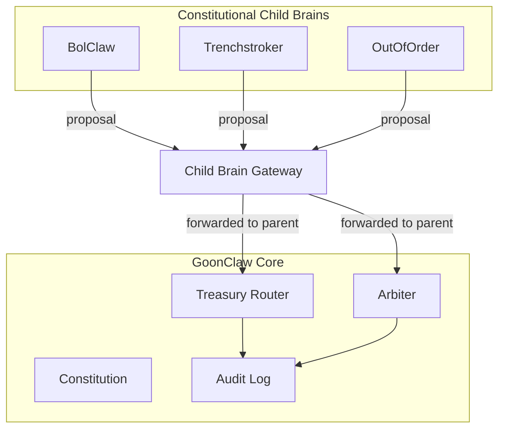

# IMPLEMENTATION NOTES
Repo-ready notes for the sovereign parent-brain architecture

## What this pack implements
- strict constitutional types in `lib/types/constitution.ts`
- strict brain and permission types in `lib/types/brains.ts`
- frozen constitutional config and invariant helpers in `lib/constitution.ts`
- typed brain configs and registry in `lib/brains/*`
- treasury/security/audit/arbiter/child-gateway workers in `workers/*`
- public constitutional endpoints in `app/api/constitution` and `app/api/brains`
- HeartBeat status enrichment in `app/api/agent/status`

## File roles
- `lib/constitution.ts`
  Canonical policy constants, lamport helpers, basis-point helpers, public-safe serializers, and parent-child execution boundaries.
- `lib/types/constitution.ts`
  Constitutional interfaces, audit types, security types, and public-state contracts.
- `lib/types/brains.ts`
  Brain ids, permission sets, child proposal types, and public brain summary contracts.
- `lib/brains/*`
  Runtime-safe brain configs for GoonClaw Core, BolClaw, Trenchstroker, and OutOfOrder.
- `workers/treasury-router.ts`
  Pure routing-plan creation, validation, and audit formatting.
- `workers/security-guards.ts`
  Pure guardrails for reserve, spend, replay, idempotency, circuit breaker, role checks, child-denial, and emergency mode.
- `workers/audit-log.ts`
  Append-only audit writer abstraction with an in-memory adapter.
- `workers/arbiter.ts`
  Deterministic dispute ordering and public-safe arbitration summaries.
- `workers/child-brain-gateway.ts`
  Proposal-only gateway for child brains. Parent review remains mandatory.

## Parent-child rule
GoonClaw Core is the sovereign parent brain.
BolClaw, Trenchstroker, and OutOfOrder are constitutional child brains.

Their rule is fixed:
"Children may think locally, but only the parent executes globally."

## Domain load targets and frontend separation
- `goonclaw.com -> brains/goonclaw`
- `bolclaw.fun -> brains/bolclaw`
- `trenchstroker.fun -> brains/trenchstroker`
- `outoforder.fun -> brains/outoforder`

These domains are distinct frontends.
Repo-hosted pages may temporarily share interface shells.
Shared shells do not grant sovereignty, signer access, or treasury authority.

## Public APIs
- `GET /api/constitution`
  Returns public-safe constitutional state, economic state, and brain-state metadata derived from `lib/constitution.ts`.
- `GET /api/brains`
  Returns child brain summaries only.
- `GET /api/brains/[brainId]`
  Returns one public child brain summary only.
- `GET /api/agent/status`
  Returns live public status plus reserve floor, creator fee policy, billboard price, trading-profit policy, governance mode, circuit-breaker posture, parent brain info, and child brain inventory.

## Where invariants are enforced
- `assertConstitutionInvariant()`
  Validates split sums, reserve positivity, required roles, parent-child rule integrity, canonical docs set, and metadata drift.
- `assertReserveFloor()` and `assertReserveFloorAfterOutflow()`
  Prevent reserve breaches.
- `assertChildBrainCannotExecute()`
  Stops child brains from globally executing.
- `assertCanonicalStateWriteAuthority()`
  Restricts treasury, reserve, arbitration, and canonical writes to the parent writer.
- `assertSpendCapWithinEpoch()`
  Enforces outflow, buyback, and trade notional caps.
- `assertSlippageWithinPolicy()` and `assertDailyLossWithinPolicy()`
  Enforce bounded execution risk.
- `evaluateCircuitBreaker()` and `assertCircuitBreakerAllowsAction()`
  Enforce open / half-open / closed behavior.

## Where parent-only execution happens
- `workers/treasury-router.ts`
  Routing plans require parent execution authority.
- `workers/arbiter.ts`
  Final arbitration requires parent canonical write authority.
- `workers/security-guards.ts`
  Parent-only and child-denial guards are explicit and reusable.
- `workers/child-brain-gateway.ts`
  Children can only submit proposals. The gateway does not execute treasury actions.

## How arbitration works
- Claims are ordered deterministically by priority, then timestamp, then weight, then lexicographic tie-break key.
- Developer-vs-holder cases can be normalized into structured arbitration cases.
- Repeated conflicts can be converted into public policy outputs.
- Public summaries omit secrets and privileged execution state.

## How reserve protection works
- All reserve math is bigint lamports.
- All percentages are basis points.
- Public serialization stringifies bigint values.
- Reserve floor enforcement happens before outflow authorization.
- Trading profit distribution is capped to realized profit above reserve.

## Public-safe state design
- No secrets.
- No signer info.
- No privileged execution flags.
- No client-trusted economic state.
- No hidden treasury mutation controls.

## Token-default boundary
Docs may mention `$BOLCLAW` as the public-facing coin ticker doctrine.
This constitutional layer does not remove or overwrite the repo's existing `$PUMP` runtime default mint configuration.

## What is intentionally stubbed
- real on-chain buyback, burn, trade, and liquidity transactions
- secure signer execution
- persistent circuit-breaker state
- persistent idempotency and replay stores
- persistent append-only audit storage
- Firestore-backed canonical state
- Helius-backed execution and telemetry hooks

## Mermaid routing diagram


## Public constitution example
```json
{
  "meta": { "protocol": "Interloper Protocol", "agent": "GoonClaw", "version": "0.2.0" },
  "reserve": { "floorLamports": "694200000", "floorSol": "0.69420" },
  "brainState": {
    "parentBrainId": "goonclaw",
    "childBrainIds": ["bolclaw", "trenchstroker", "outoforder"],
    "executionRule": "Children may think locally, but only the parent executes globally."
  }
}
```

## Secure infra still needed later
- Firestore or equivalent durable state for idempotency, replay, audit, and breaker state
- signer / KMS / HSM integration for parent-only execution
- Helius / on-chain settlement integration
- durable governance tallying
- durable Merkle rights roots and claim-consumption storage
